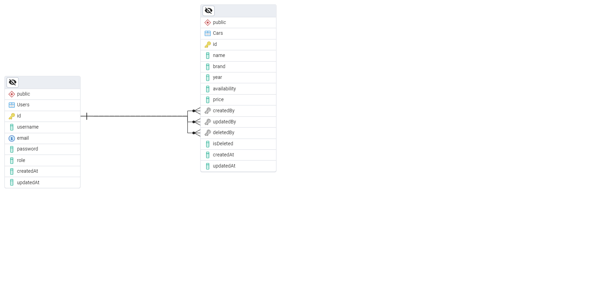

<h1 align="center">
  Car Management API
</h1>

<h4 align="center">Challenge ch-5</h4>

## Models

- Users, attributes:
  - username (String),
  - email (String),
  - password (String),
  - role (String)
- Cars, attributes:
  - name (String),
  - brand (String),
  - year (Integer),
  - availability (Boolean),
  - price (Integer),
  - createdBy (Integer),
  - updatedBy (Integer),
  - deletedBy (Integer),
  - isDeleted (Boolean)

## ERD

## URL

Base URL= "localhost:3000/api/v1"

### API Endpoints

| HTTP Methods | Endpoints             | Request Body                           | Request Headers Authorization       | Action                      |
| ------------ | --------------------- | -------------------------------------- | ----------------------------------- | --------------------------- |
| GET          | /health-check         | None                                   | None                                | For health-check            |
| POST         | /users/register       | (REQUIRED) username, email, password   | None                                | Register new user as member |
| POST         | /users/admin-register | (REQUIRED) username, email, password   | Bearer token (super admin)          | Register new user as admin  |
| POST         | /users/login          | (REQUIRED) email and password          | None                                | Login all role user account |
| POST         | /cars                 | (REQUIRED) name, brand, year, price    | Bearer token (admin or super admin) | Create a new car            |
| GET          | /cars                 | None                                   | Bearer token (all role)             | Get all car data            |
| GET          | /cars/:carsId         | None                                   | Bearer token (all role)             | Get car data by id          |
| PATCH        | /causes/:causeId      | name, brand, year, availability, price | Bearer token (admin or super admin) | Update car data             |
| DELETE       | /cars/:carsId         | None                                   | Bearer token (admin or super admin) | Delete car data by id       |

### API Documentation Endpoint

http://localhost:3000/api-docs/#/

### Super Admin

username: superAdmin
password: superAdmin
